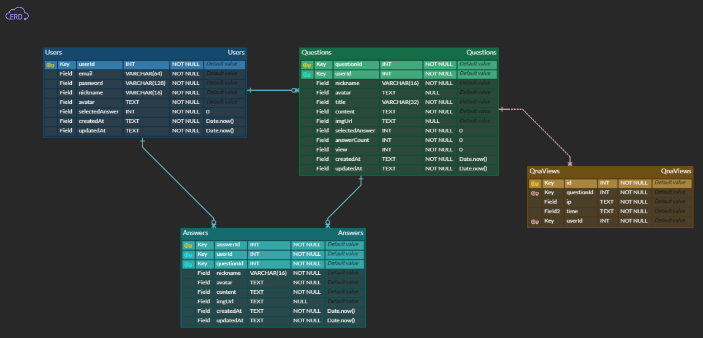

---

# ✨Q-Port (Question Port)

-   **모든 궁금증과 답이 연결되어 있는 통로.**

# 📆 프로젝트 기간

-   2022/10/21 ~ 2022/10/27

# 👒 팀 소개

| 역할      | 이름   | git                              |
| --------- | ------ | -------------------------------- |
| Back-end  | 왕준혁 | https://github.com/Monggle88%7C  |
| Back-end  | 최원선 | https://github.com/wonsunny%7C   |
| Back-end  | 장용호 | https://github.com/JangKroed%7C  |
| Front-end | 한세준 | https://github.com/hansejun%7C   |
| Front-end | 이민기 | https://github.com/Pasilda123%7C |

# 👔 Project Architecture


# 🩳 API 명세서

[▶ Q-Port REST API 바로가기](https://www.notion.so/88eac097402442b4a0e7d54d5fc60c77?v=ce5ebdb9fb1a44dcb1842f8022d5bfd7)

# 🧦 DB 설계도(ERD)



# 👟 사용한 라이브러리(패키지)

### ✅ 백엔드에서 이미지 처리를 한 이유

-   이미지 용량 제한을 할 수 있고, DB와 S3를 연동하여 확실한 데이터 처리가 가능함. 예를 들어, 유저가 게시물을 삭제하거나 회원 탈퇴할 경우, 어떤 유저의 파일인지 추적, 처리하여 메모리 낭비를 줄이고, 데이터의 무결성을 증대할 수 있음.

### ✅ 관계형 데이터베이스(RDBMS)를 사용한 이유

-   프로젝트 구조 상 유저를 중심으로 관계를 맺는 데이터가 많기 때문에 DB indexing으로 데이터 관리를 용이하게 함.

### ✅ 왜 session이 아닌 jwt방식을 선택했을까?

-   **세션 방식**은 서버의 메모리 내부에 유저의 정보를 저장함. 유저의 수가 증가할수록 세션의 양이 많아지는 만큼 메모리에 부하가 걸릴 수 있음. 실제 서비스 배포를 위한 프로젝트에서는 유저의 수가 적지 않을 거라 예상하여 **JWT 토큰 인증방식** 선택. JWT는 서버의 메모리에 저장 공간을 확보하지 않고 토큰 발급 및 확인 절차만 거치므로 서버 자원과 비용을 절감할 수 있음.
-   하지만 현재 무드캐처의 **jwt 방식은 토큰의 유효기간이 만료되지 않으면 소멸하지 않기 때문에 토큰 탈취, 해킹 등 보안에 취약점을 가지고 있음. access token/refresh token으로 변경하여 보안 강화 필요.**

# 💍 기술 소개

```json

"dependencies"

    "aws-sdk": "^2.1238.0",     // aws 서비스를 사용하기 위한 라이브러리
    "bcrypt": "^5.0.1",         // 비밀번호 해쉬화를 위한 라이브러리
    "cookie-parser": "^1.4.6",  // 요청 된 쿠키를 추출 할 수있게 해주는 미들웨어
    "cors": "^2.8.5",           // CORS 이슈 해결을 위한 라이브러리
    "bcrypt": "^5.1.0",         // 유저 비밀번호 해쉬를 위한 라이브러리
    "dotenv": "^16.0.3",        //.env의 정보를 환경변수로 등록해주는 라이브러리
    "express": "^4.18.2",       // 웹 서버를 구현하기 위한 라이브러리
    "helmet": "^6.0.0",         // header에 설정을 통해 웹 취약점으로부터 서버 보호
    "jsonwebtoken": "^8.5.1",   // jwt로그인 방식을 위한 라이브러리
    "multer": "^1.4.5-lts.1",   // image를 form데이터로 받기 위한 라이브러리
    "multer-s3": "^2.10.0",     // aws s3를 multer와 연결해주는 라이브러리
    "mysql2": "^2.3.3",         // mysql을 사용할 수 있게 해주는 라이브러리
    "joi": "^17.6.4",           // 들어오는 입력값에 대한 유효성 검사를 해주는
    "prettier": "^2.7.1",       // 코드 컨벤션을 위한 라이브러리
    "sequelize": "^6.25.3",     // ORM 라이브러리


"devDependencies": {
    "sequelize-cli": "^6.4.1",   // Sequelize 지원 라이브러리
    "nodemon": "^2.0.20",        // 서버 재 가동을 쉽게 해주는 라이브러리
    "morgan": "^1.10.0",         // 통신 로그를 남기기 위한 라이브러리
  }

```

# 💎트러블 슈팅

## [FE]

1. 첫 백엔트 서버 API와 연결 시 로그인 후 받은 토큰을 검증에 필요한 페이지에서 토큰을 헤더에 담아 보내는데 백엔드 서버에서 못받은 문제.

-   토큰을 send으로 받아와 헤더에 authorization으로 보내고 백엔드에서 req.headers.authorization 로 검증하는 식으로 변경해서 해결

2. Vercel로 배포시 https 로 되어 백엔드서버인 http와 통신이 불가하여 API자체를 못받아오는 문제

-   EC2를 통해 http로 배포하여 해결

3. 새로고침 할때마다 캐릭터가 변경되게 했는데 캐릭터의 사이즈와 위치가 다른 문제

-   민기님 작성해주세요

4. 로그인한 유저에 대한 검증을 위하여 쿠키 유무를 포함한 userId가 필요하여 유저 정보를 받아오는 요청을 불필요하게 많이 보내게 되는 문제

-   클라이언트 내에서 jwt 토큰값을 디코딩하여 userId를 추출해 사용하여 불필요한 요청을 방지.

5. 프론트에서 이미지 파일을 보낼 때 서버가 인식하지 못하는 문제

-   post 요청을 보낼 때 header에 "Content-Type": "multipart/form-data"를 넣어 전송. 이미지를 추가 / 편집하는 기능들이 많아 인스턴스로 만들어 사용.

## [BE]

1. 사진 업로드시 저장되는 imgUrl이 전체가 아닌 일부로 저장되는 문제.

-   response로 받는 imageUrl은 전체로 나오고 DB에 저장은 일부분만 나와서 코드를 살펴보니 구현 자체를
    url 뒷부분인 /post/파일명.확장자 식으로 보내고 response는 전체가 나오다보니 착각에서 비롯한 실수였습니다.

2. RDS요금 청구 이슈로 EC2 인스턴스에서 mysql을 localhost로 사용시 한글 입력을 못하는 문제

-   아직까지 알아본 바로는 테이블 속성중 유니코드 관련 이슈인 것 같습니다. sql문을 이용하여 변경을 해보려 노력중입니다.
-   3번과 비슷한 설정문제였는데, mysql.cnf 파일 안에 utf관련 코드입력후 해결하였습니다.

3. ec2 local환경에서 mysql을 구현하다보니 DB확인이 안되는 문제.(Incorrect string value)

-   mysql.cnf 설정이 로컬에서만 접근 가능했던 문제, 외부에서 접근 가능하도록 변경하여 해결하였습니다.

4. db table에 없는 데이터를 만들어 가공하여 FE에 보내주어야 할 때 원하는 데이터를 어떻게 뽑아서 가공해야할지 난감했습니다.
   개발중인 환경이고 사이즈가 작은 프로젝트이니 간단히 필요로하는 항목을 테이블에 추가해주면 해결할 수 있었지만, 모종의 이유로 table 수정이 불가능 할 경우를 가정하여,
   현재 table 상황에 맞추어 코드를 작성해보는 방향으로 도전해보기로 했습니다.
   상황에 따라 N개의 Object를 만들고 DB에 접근하여 필요한 데이터를 뽑아 가공하여 그것들을 담은 Object를 만들고 Array에 담아주는 반복문을 이용하여 해결했습니다.
   (./service/answer.service.js/'userId기준 답변을 한 질문 목록 불러오기 + 상태')

5. 회원정보 수정 기능의 3가지 분기를 단 한번의 요청으로 처리해야할 때 예외처리 등 구현의 방향이 잡히지 않아 난감했습니다.
   닉네임만 변경하는 경우, 비밀번호만 변경하는경우, 둘 모두 변경하는 경우 3가지를 body에 들어오는 데이터를 기준으로 if문을 통해 어떤 동작을 수행할지 나누어
   각각의 경우에 알맞은 동작만 수행할 수 있도록하여 불필요한 구동을 하지 않도록 코드를 작성하여 해결했습니다.
